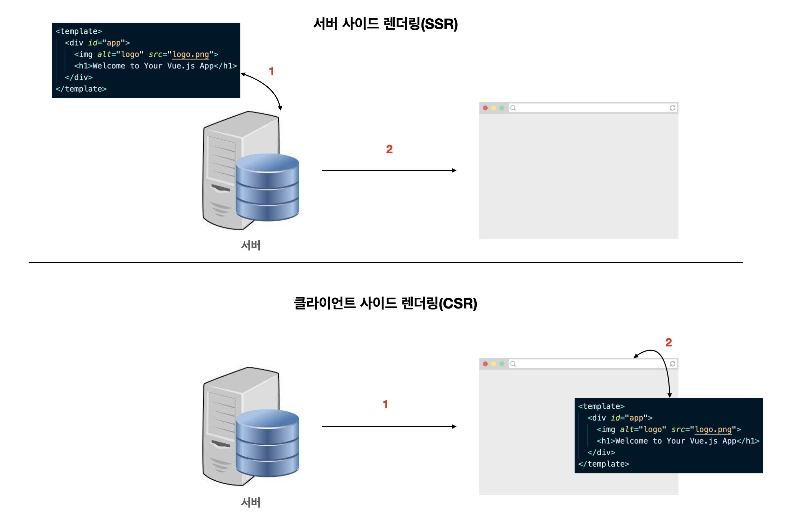

# 01. Nuxt.js 소개

## 01-01. Nuxt.js 소개

Nuxt는 Vue.js로 빠르게 웹을 제작할 수 있게 도와주는 프레임워크.

`Vuex`, `Router`, `Axios`같은 라이브러리들을 미리 구성하여 `SPA(Single Page Application)`, `SSR(Server Side Rendering)`, `정적웹 사이트(Static Generated Website)`를 쉽게 제작할 수 있다.

> 서버사이드 렌더링이란 
>
> 웹 페이지의 내용을 서버에서 모두 작성해 클라이언트(브라우저)로 보낸 뒤 화면에 그리는 방식


## 01-02. 서버 사이드 렌더링이란?

Guide : [서버 사이드 렌더링이란](https://joshua1988.github.io/vue-camp/nuxt/ssr.html)

서버에서 페이지를 그려서 클라이언트(브라우저)로 보낸 후 화면에 표시하는 기법.

SPA라 가정했을 때 Example

```javascript
window.addEventListener('hashchange', event=> console.log(event));
```

hashchange 이벤트를 추가하게 되면 url이 바뀔때 마다 그 값에 의해 이벤트가 발생한다.

SPA는 이 hashevent동작 기반으로 동작한다.

event를 잡아서 화면의 DOM을 서버로 가지않고 바꿔준다 => SPA


## 01-03. 클라이언트 사이드 렌더링(CSR)과 서버 사이드 렌더링(SSR)의 차이점

[클라이언트 사이드 렌더링](https://joshua1988.github.io/vue-camp/nuxt/ssr.html#클라이언트-사이드-렌더링)

```javascript
// src/main.js
import Vue from "vue";
import App from "./App.vue";

new Vue({
  render: (h) => h(App),
}).$mount("#app");
```

```html
<!-- public/index.html -->
<!DOCTYPE html>
<html lang="">
  <head>
    <!-- ... -->
  </head>
  <body>
    <noscript>
      <strong>We're sorry but <%= htmlWebpackPlugin.options.title %> doesn't work properly without JavaScript enabled. Please enable it to continue.</strong>
    </noscript>
    <div id="app"></div>
    <!-- built files will be auto injected -->
  </body>
</html>
 
```

위의 인스턴스가 아래에 부착(instance mounting)되서 화면을 그려내는것이 SPA이면서 클라이언트 사이드 렌더링이라 표현한다.


`서버 사이드 렌더링`은 페이지를 그리기 위한 동작이 서버에서 그려서 브라우저로 보여주는 것이고, `클라이언트 사이드 렌더링`은 서버에서 빈페이지를 던지고, 자바스크립트 라이브러리가 실행 되면서 비어있는 태그를 채워나가는 것




## 01-04. 클라이언트 사이드 렌더링과 서버 사이드 렌더링 결과 비교

CSR Example : [구글 커리어 사이트](https://careers.google.com/)

SSR Example : [캡틴판교 블로그](https://joshua1988.github.io/)


개발자도구 Doc탭을 가게되면 화면 구성을 위한 html파일을 볼 수 있다.

CSR의 경우 app-root내용이 브라우저로 가져와서 그린다.


SSR의 경우 화면을 구성하는 모든 내용(Text 등)이 들어가있는게 보여진다.


## 01-05. 서버 사이드 렌더링을 왜 쓸까?

[SEO(Search Engine Optimization) 가이드](https://developers.google.com/search/docs/fundamentals/seo-starter-guide?hl=ko)

SSR을 쓰는 가장 큰 이유는 `검색 엔진 최적화(SEO)`와 `빠른 페이지 렌더링`이다.

CSR의 경우 사용자 장비에 따라 결과의 속도가 달라질 수 있다.


가장 효율적일 수 있는 부분이 **`OG(Open Graph) Tag`**에 의한 정보 전달이다.

특정 링크를 공유했을때 아래에 정보를 나타내는 부분이 `OG Tag`이다.


(SPA의 경우 별도의 조치를 하지 않는 경우 하나의 html파일에서 찾기 때문에 같은 정보만 나타나게 된다.)


### 서버 사이드 렌더링의 단점

학습비용이 초반에 있다는게 크다. => Node.js에 대한 부분, 서버 빌드에 대한 이해등 서버에 대한 이해가 필요.

Node.js환경에서 실행되기 때문에 브라우저 API사용시 주의 해야함.


## 01-06. Nuxt의 장점과 특징

**장점**

* 검색 엔진 최적화
* 초기 프로젝트 설정 비용 감소와 생산성 향상
  * ESLint, Prettier
  * Router, Store등의 라이브러리 설치 및 설정 파일 필요 X
  * 파일 기반의 라우팅 방식, 설정 파일 자동 생성<br/>라우터를 일일이 생성하지 않아도 특정 폴더밑에 Vue파일들을 만들어나가면 그걸 기반으로 라우터를 생산 해준다.
* 페이지 로딩 속도와 사용자 경험 향상
  * 브라우저가 하는 일을 서버에 나눠준다.
  * 모르면 지나칠 수 있는 코드 스플리팅이 기본으로 설정<br/>(코드 스플리팅은 SPA에서 100개페이지를 처음에 다 로딩할 필요 없이 페이지 진입마다 들고오게 만드는것. **Nuxt의 경우 라우터별로 코드 스플리팅이 다 자동 적용되어 있다.**)


**Nuxt 특징**

* 서버 사이드 렌더링
* 규격화된 폴더 구조 (layouts, store, middleware, plugins 등)<br/>어떤 파일들을 어떤 폴더에 넣어야된다는 규격을 따라가야한다.
* pages폴더 기반의 자동 라우팅 설정
* 코드 스플리팅
* 비동기 데이터 요청 속성
* ES6/ES6+ 변환
* 웹팩을 비롯한 기타 설정