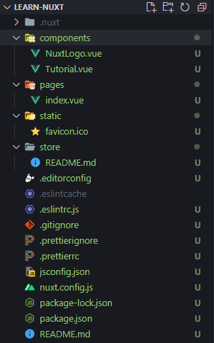
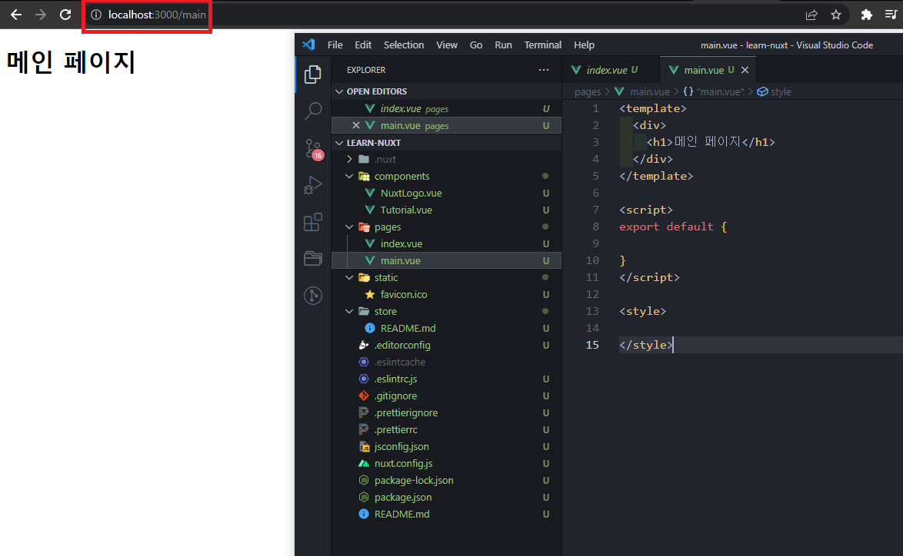
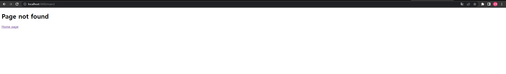
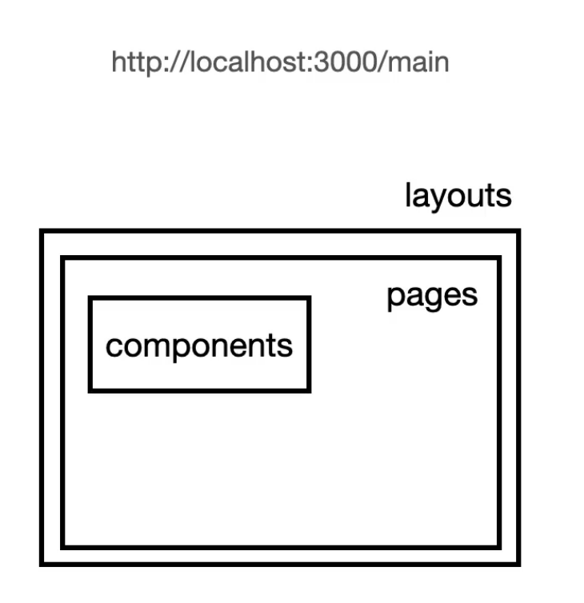
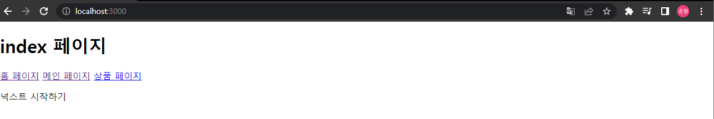

# 02. Nuxt.js 프로젝트 시작하기

## 02-01. Nuxt 프로젝트 생성

참고 : [Nuxt.js 설치 문서](https://nuxtjs.org/docs/get-started/installation/)

```shell
npm init nuxt-app <project-name>

cd <project-name>
npm run dev
```


설치시

```text
Project name : learn-nuxt
Programming language : JavaScript
Package manager : Npm
UI framework : None (Vuetify, Ant-design-vue, ....)
Nuxt.js modules : None (Axios, Progress Web App(PWA), Content가 뜨는데 아무것도 체크 X)
Linting tools: ESLint, Prettier
Testing framework : None (Jest, Ava, ...)
Rendering mode: Universal(SSR / SSG) (nuxt cli로도 Single Page App을 생성할 수 있다는게 특징.)
Deployment target : Server
Development tools : jsconfig.json
Continuouse integration : None (Github Actions, Travis CI, CircleCI)
Version control system : Git
```

SSR = Server Side Rendering / SSG = Static Site Generator

```shell
cd learn-nuxt
npm run dev
```


>  ❗ 설치가 안될 때
>
> 1. npm, npx로 설치가 안되서 yarn으로 설치
>
> 2. 그 후 npm명령어가 실행되지 않음 => node modules삭제후 다시 npm install
> 3. npm run dev오류 => node의 버전 문제  => 버전 17이하로 낮추면 정상동작. (현재 버전 16.18.0)


## 02-02. 프로젝트 폴더 구조 설명



* `.nuxt` : build 결과물 폴더<br/> .nuxt 삭제 후`npm run dev`로 결과 다시 확인 가능.

* `assets` : img, css등 웹 리소스들
* `components ` : vue 개발시 사용하는 컴포넌트
* `layouts` : 라우터를 기준으로 특정 url에 뿌려질때 가장 최상위의 루트 컴포넌트.
* `middleware` : SSR 진행시 서버에서 브라우저로 파일들을 넘기기 전에 항상 실행시키는 함수
* `pages` : 화면에 그려지게 될 페이지 컴포넌트들 (라우터 자동 설정)
* `plugins` : Vue 플러그인, instance 생성전에 초기화 할 라이브러리나 코드들
* `static` : 빌드 시 서버의 루트주소로 옮기게될 변경이 필요하지 않은 정적자원들 (favicon, ...)
* `store` : Vuex의 스토어를 의미

> 위 사진(`현재`)과 강의의 폴더구조가 조금 다르니 참고.<br/>
>
> 강의 메세지
>
> Nuxt.js 버전 2.15.7부터 프로젝트 폴더 구조가 바뀌었습니다. 이후 강의 수강하는데 크게 문제는 없으니 참고해 주세요 :)

**❗ Nuxt프레임워크에 정해진 폴더 규칙을 따르자.**


## 02-03. 메인 페이지 생성 및 결과 확인

pages폴더에 main.vue를 생성하게되면 경로에 `/main`을 붙였을때 main.vue의 내용이 보여지는걸 확인할 수 있다.



루트URL(localhost:3000)가 현재 Index.vue파일을 의미.

layout폴더의 default.vue를 보면 `<Nuxt />`가 있는데 이부분이 `router-view`를 의미한다.


## 02-04. 페이지 컴포넌트 빌드 결과 확인

어떻게 pages에 파일을 등록하자마자 url이 바뀌는지 알아보자.

`.nuxt`폴더의 router.js의 option을 살펴보자

```javascript
...
export const routerOptions = {
  mode: 'history',
  base: '/',
  linkActiveClass: 'nuxt-link-active',
  linkExactActiveClass: 'nuxt-link-exact-active',
  scrollBehavior,

  routes: [{
    path: "/main",
    component: _46e9fbe9,
    name: "main"
  }, {
    path: "/product",
    component: _44a090ef,
    name: "product"
  }, {
    path: "/",
    component: _77ca5d52,
    name: "index"
  }],

  fallback: false
}
...
```

파일을 생성하면 product란 경로와 컴포넌트가 자동으로 생성되는걸 볼 수 있다.


## 02-05. 에러 페이지 정의 방법

만약 정의되지 않은 경로로 접근 시 기본적으로 Nuxt의 에러페이지가 출력된다.

custom 해보자.

>  ❗ 버전이 올라가면서 조금 바뀐부분
>
> layouts폴더가 없어 같은 이름으로 layouts폴더를 생성하고, 
>
> 안에다가 props로 error.statusCode 를 받아서 출력.

```vue
<template>
  <div>
    <h1 v-if="error.statusCode === 404">Page not found</h1>
    <h1 v-else>An error occurred</h1>
    <NuxtLink to="/">Home page</NuxtLink>
  </div>
</template>

<script>
  export default {
    layout: 'error',
    props: ['error'] // you can set a custom layout for the error page
  }
</script>
```



**참고**

* [공식사이트 Error Page](https://nuxtjs.org/docs/concepts/views/#error-page)

* [강의 질문 및 댓글](https://www.inflearn.com/questions/313752)


## 02-06. Nuxt의 라우팅관련 컴포넌트 정리

layouts -pages - components의 위계.




## 02-07. 레이아웃 컴포넌트 소개

언제 레이아웃을 써야하는가!

기존에 생성했던 파일을 아래처럼 수정해보자.

```vue
// index.vue
<template>
  <div>
    <h1>홈 페이지</h1>
    <p>넉스트 시작하기</p>
  </div>
</template>
```

```vue
// main.vue
<template>
  <div>
    <h1>메인 페이지</h1>
    <p>메인 페이지 입니다.</p>
  </div>
</template>
```

```vue
// product.vue
<template>
  <div>
    <h1>상품 페이지</h1>
    <ul>
      <li>상품 1</li>
      <li>상품 2</li>
      <li>상품 3</li>
    </ul>
  </div>
</template>
```

3개 모두 h1이 가장 위에 들어가는걸 볼 수 있다. => **공통 UI**

공통된 부분에 대해 default.vue에서 공통 헤더를 정의할 수 있다.

```vue
// layouts/default.vue
<template>
  <div>
    <h1>{{$route.name}} 페이지</h1>
    <Nuxt/>
  </div>
</template>
```

즉, 공통적인 부분을 layout으로 빼고, 각 화면에서는 h1으로 작성한 부분을 삭제 할 수 있다.

page는 해당 페이지의 컨텐츠에 집중할 수 있는 형태가 가능해진다.


## 02-09. nuxt-link 태그 소개

기존의 router-link가 nuxt-link로 대체된다.

```vue
<template>
  <div>
    <header>
      <h1>{{$route.name}} 페이지</h1>
      <NuxtLink to="/">홈 페이지</NuxtLink>
      <NuxtLink to="/main">메인 페이지</NuxtLink>
      <NuxtLink to="/product">상품 페이지</NuxtLink>
    </header>
    <Nuxt/>
  </div>
</template>
```



* `<router-view>` = `<Nuxt>`

* `<router-link>` = `<NuxtLink>`

