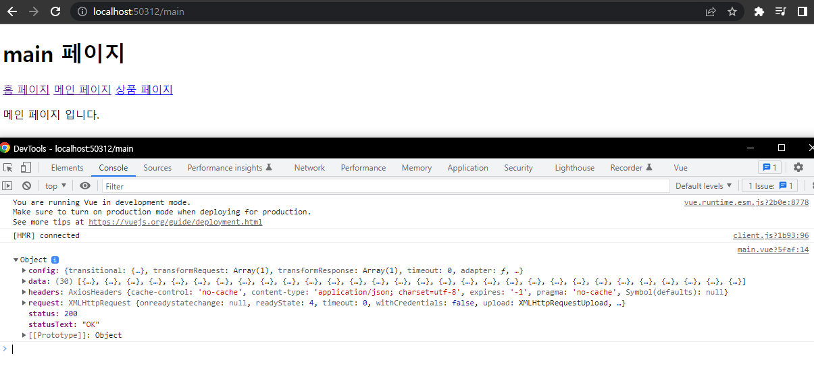
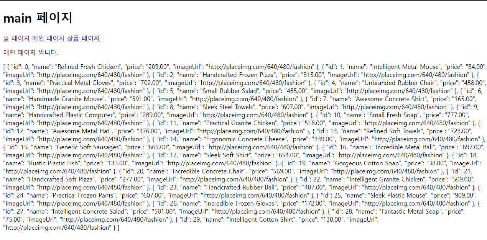

# 03. Nuxt의 데이터 호출 방식과 API 연동

## 03-01. 백엔드 API 서버 구성

[백엔드 repo 주소](https://github.com/joshua1988/learn-nuxt/tree/master/backend)

1. backend 폴더 복사

```shell
git clone 'git 주소'
```

2. backend폴더에서 terminal을 열어서 `npm install`실행<br/>json-server패키지 설치
3. `npm run dev`로 서버 실행

**❗ 백엔드 서버 실행 시 프런트엔드 서버가 종료되 있어야 함.<br/>(백엔드가 실행되있는 상태라면 프런트엔드의 포트가 랜덤으로 붙게됨.)**


## 03-02. JSON Server 소개

[JSON Placeholder](https://jsonplaceholder.typicode.com/) : open api형태로 프론트 -> 백으로 rest호출해보듯이 테스팅 해볼수 있는 사이트.<br/>(이를 mock api(API 모방)라 함.)<br/>localhost:3000/products를 하게되면 데이터를 볼 수 있다.

[JSON-Server Git](https://github.com/typicode/json-server) : 파일기반의 test용 API 서버라고 생각.


## 03-03. axios 설치 및 API 호출

```shell
npm i axios
```

설치 후 axios를 main.vue에서 바로 사용

```vue
// main.vue
<template>
  <div>
    <!-- <h1>메인 페이지</h1> -->
    <p>메인 페이지 입니다.</p>
  </div>
</template>

<script>
import axios from 'axios';

export default {
  async created(){
	const response = await axios.get('http://localhost:3000/products')
    console.log(response)
  }
}
</script>
```




## 03-04. 서버 포트 변경 및 받아온 데이터 표시

nuxt.config.js를 수정해주면 된다.

```javascript
server:{
    port: 5000,
}
```


```vue
// Main.vue
<template>
  <div>
    <!-- <h1>메인 페이지</h1> -->
    <p>메인 페이지 입니다.</p>
    <div>
      {{products}}
    </div>
  </div>
</template>

<script>
import axios from 'axios';

export default {
  data(){
    return{
      products:[],
    }
  },
  async created(){
    const response =    await axios.get('http://localhost:3000/products');
    console.log(response);
    this.products = response.data;
  }
}
</script>
```



새로고침을 하면 깜빡이는걸 볼 수 있다.

먼저 화면이 떠있는 상태에서 데이터를 받아오기 때문!


**참고**

* [서버 설정 변경 안내 문서](https://nuxtjs.org/docs/features/configuration/#edit-host-and-port)

* [HMR(Hot Module Replacement) 안내문서](https://joshua1988.github.io/webpack-guide/devtools/hot-module-replacement.html)


## 03-05. Nuxt 데이터 호출 방식 안내

created와 Nuxt에서의 차이점을 알아보자

Nuxt는 서버사이드 렌더링 프레임워크기 때문에 Vue SPA와 RESP API를 호출하는 방식을 다르게 접근해야한다.

라이프 사이클을 이용이 가능은하지만, 권장하지 않는다.


### Nuxt의 REST API 호출 방식

* asyncData
* fetch

**❗ 꼭 참고링크 읽어보기**

**asyncData**

Nuxt에서 페이지 컴포넌트에만 제공되는 속성.

```vue
<!-- pages/user.vue -->
<template>
  <div>
    <p>{{ user }}</p>
  </div>
</template>

<script>
import axios from 'axios';

export default {
  // params의 id가 1이라고 가정
  async asyncData({ params, $http }) {
    const response = await axios.get(`/users/${params.id}`);
    const user = response.data;
    return { user }
  }
}
</script>
 
```


**참고**

* [Nuxt의 비동기 데이터 호출 방법](https://joshua1988.github.io/vue-camp/nuxt/data-fetching.html)


## 03-06. asyncData적용 및 ESLint 규칙 확인

바로 적용해보면 asyncData를 data밑에 작성하고, 저장하자마자 가장 위로 올라간다.

```vue
...
data(){...},
asyncData(){},

-------------------
asnycData(){},
data(){...}
```

만약 안된다면, ESLint 수정

created의 내용을 asyncData로 이동.

```vue
...
<script>
import axios from 'axios';

export default {
  async asyncData(){
    const response = await axios.get('http://localhost:3000/products');
    console.log(response);
    this.products = response.data;
  },
  data(){
    return{
      products:[],
    }
  },
}
</script>

<style>

</style>
```

this에서 `Unexpected this in asnycData`라고 lint에서 알려준다.


## 03-07. asyncData속성 안내 및 코드 수정

```vue
<!-- pages/user.vue -->
<template>
  <div>
    <p>{{ user }}</p>
  </div>
</template>

<script>
import axios from 'axios';

export default {
  // params의 id가 1이라고 가정
  async asyncData({ params, $http }) {
    const response = await axios.get(`/users/${params.id}`);
    const user = response.data;
    return { user }
  }
}
</script>
```

user에 response를 담아 그대로 리턴하는 것을 볼 수 있다.

서버에서 rest api 요청해서 값을 다 들고 와 구성을 해 화면에 연결해주는 것이 asyncData다.

기본적으로 페이지 진입전에 호출되는 속성이다.

리턴되는 값이 vue의 data처럼 동작한다.


다시 main.vue로 가서 this가 에러가 뜨는 이유는 asyncData가 화면이 그려지기 전에 동작하기 때문.<br/> => **컴포넌트가 생성되기 이전이라 가리키는 값이 없다.**

```vue
// main.vue
<template>
  <div>
    <!-- <h1>메인 페이지</h1> -->
    <p>메인 페이지 입니다.</p>
    <div>
      {{products}}
    </div>
  </div>
</template>

<script>
import axios from 'axios';

export default {
  async asyncData(){
    const response = await axios.get('http://localhost:3000/products');
    // console.log(response);
    const products = response.data;
    return products;
  },
}
</script>
```

항상 데이터가 존재하는 형태로 뿌려지는 것을 볼 수 있다. => 깜빡거림이 없어짐.


## 03-08. asyncData 주의사항

main.vue에서 하던걸 ProductsList컴포넌트를 만들어 동작시키자

```vue
// main.vue
<template>
  <div>
    <!-- <h1>메인 페이지</h1> -->
    <p>메인 페이지 입니다.</p>
    <ProductList></ProductList>
  </div>
</template>

<script>
// import axios from 'axios';
import ProductList from '~/components/ProductList.vue';

export default {
  components: { ProductList },
}
</script>
```

```vue
// components/ProductList.vue
<template>
  <div>
    {{products}}
  </div>
</template>
<script>
import axios from 'axios';
export default{
  async asyncData(){
    const response = await axios.get('http://localhost:3000/products');
    // console.log(response);
    const products = response.data;
    return {products};
  },
}
</script>
```


`Nuxt SSR`에서 에러가 발생(서버쪽 에러)

**❗ asyncData는 `pages컴포넌트`에만 유효한 속성이기 때문이다**


## 03-09. asyncData 정리

다음 챕터에서 안의 인자에 대해 알아 볼 예정.

라우터의 네비게이션 가드와 asyncData가 유사하게 동작.

asyncData를 이용하여 비슷한 기능을 구현할 수 있다.