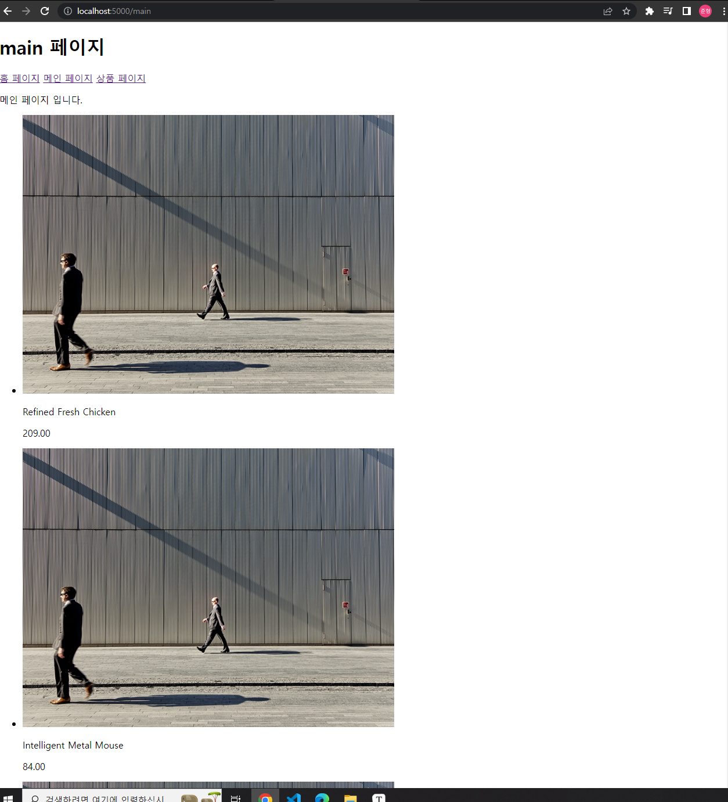
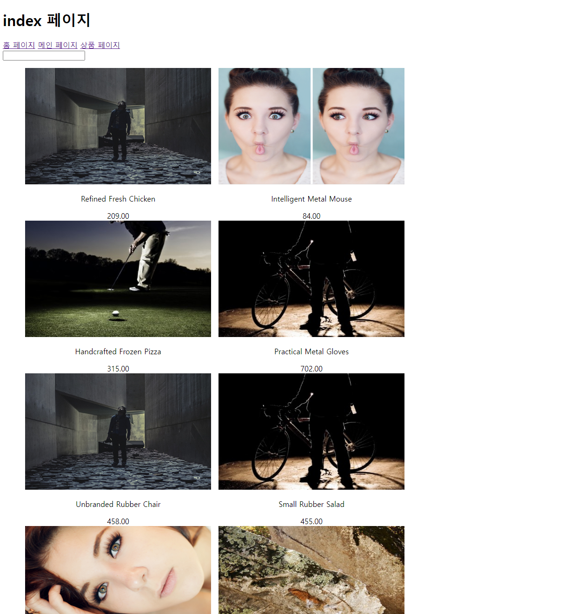
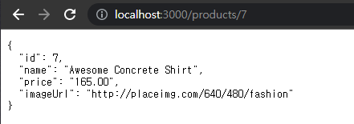
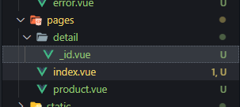
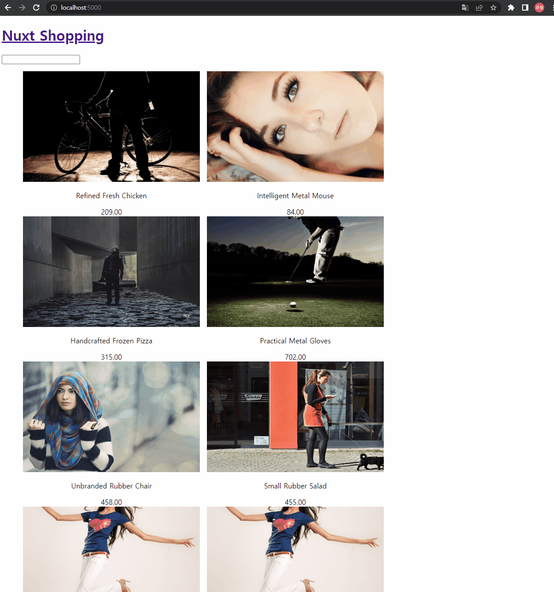

# 04. 쇼핑 상품 목록 페이지와 상세 페이지 개발

## 04-01. 상품 목록 표시 기능 구현

main.vue를 원상복구 후 리스트로 출력.

> **새로고침시 Error**
>
> ❗ 새로고침시 require() 관련 Error가 발생했었는데 axios의 버전 문제였다.
>
> 질문게시판의 아래 댓글을 참고해 진행하였더니 해결됨.
>
> ```shell
> 1. npm uninstall axios
> 
> 2. npm install axios@0.27.2
> 
> 3. 서버 실행 후 동작 확인
> ```

```vue
// main
<template>
  <div>
    <!-- <h1>메인 페이지</h1> -->
    <p>메인 페이지 입니다.</p>
    <div>
      <ul>
        <li v-for="product in products" :key="product.id">
          
          <p>{{product.name}}</p>
          <p>{{product.price}}</p>
        </li>
      </ul>
    </div>
  </div>
</template>

<script>
import axios from 'axios';

export default {
  async asyncData(){
    const response = await axios.get('http://localhost:3000/products');
    // console.log(response);
    const products = response.data;
    return {products};
  },
  // data(){
  //   return{
  //     products:[],
  //   }
  // },

  // async created(){
  //   const response =    await axios.get('http://localhost:3000/products');
  //   console.log(response);
  //   this.products = response.data;
  // }
}
</script>
```




문제점이 있다.

data들의 이미지 url들을 동일한 도메인에 대해서  동일한 데이터를 주게끔 캐싱전략을 가지고 있어 전략을 피하기 위해 부가작업이 필요하다.

random숫자를 넣어 매번 다른 이미지가 출력되도록 해보자.

```vue
// main.vue
...
<script>
import axios from 'axios';

export default {
  async asyncData(){
    const response = await axios.get('http://localhost:3000/products');
    // console.log(response);
    const products = response.data.map(item=>({
      ...item, 
      imageUrl: `${item.imageUrl}?random=${Math.random()}`
    }));
    return {products};
  },
}
</script>
```


## 04-02. 라우팅 및 스타일링 정리

main.vue에서 했던거를 index.vue를 낭비하지않기 위해 이동시켜 바로 index.vue가 보이게 하고, main.vue는 삭제.

그리고 보이는형태를 조금 수정.

```vue
<template>
  <div class="app">
    <main>
      <div>
        <input type="text">
      </div>
      <ul>
        <li v-for="product in products" :key="product.id">
          
          <p>{{product.name}}</p>
          <p>{{product.price}}</p>
        </li>
      </ul>
    </main>
  </div>
</template>

<script>
import axios from 'axios';

export default {
  async asyncData(){
    const response = await axios.get('http://localhost:3000/products');
    // console.log(response);
    const products = response.data.map(item=>({
      ...item, 
      imageUrl: `${item.imageUrl}?random=${Math.random()}`
    }));
    return {products};
  },
}
</script>
```


이제 스타일링을 진행해보자.

아래 참고 코드 링크에서 style부분을 가져오고 class를 알맞게 넣어주자.

[스타일링 참고 코드](https://github.com/joshua1988/learn-nuxt/blob/master/pages/index.vue)

```vue
// index.vue
<template>
  <div class="app">
    <main>
      <div>
        <input type="text">
      </div>
      <ul>
        <li v-for="product in products" :key="product.id" class="item flex">
          
          <p>{{product.name}}</p>
          <span>{{product.price}}</span>
        </li>
      </ul>
    </main>
  </div>
</template>

...
<style scoped>
.flex {
  display: flex;
  justify-content: center;
}
.item {
  display: inline-block;
  width: 400px;
  height: 300px;
  text-align: center;
  margin: 0 0.5rem;
  cursor: pointer;
}
.product-image {
  width: 400px;
  height: 250px;
}
.app {
  position: relative;
}
.cart-wrapper {
  position: sticky;
  float: right;
  bottom: 50px;
  right: 50px;
}
.cart-wrapper .btn {
  display: inline-block;
  height: 40px;
  font-size: 1rem;
  font-weight: 500;
}
</style>
```



이제 클릭했을때 상세페이지로 넘어가도록 해보자.


## 04-03. 상품 상세 페이지 구현을 위한 사전 작업

먼저 layout에서 불필요한 부분을 삭제하자.

```vue
// layouts/default.vue
<template>
  <div>
    <header>
      <h1>Nuxt Shopping</h1>
    </header>
    <Nuxt/>
  </div>
</template>
```

dynamic 라우트를 하기 위해 특정 id나 url값들을 가지고 넘어가야한다.

먼저 클릭이벤트를 추가.

```vue
<template>
  <div class="app">
    <main>
      <div>
        <input type="text">
      </div>
      <ul>
        <li v-for="product in products" 
            :key="product.id" 
            class="item flex" 
            @click="moveToDetailPage(product.id)">
          
          <p>{{product.name}}</p>
          <span>{{product.price}}</span>
        </li>
      </ul>
    </main>
  </div>
</template>
<script>
...
 methods:{
    moveToDetailPage(id){
      console.log(id)
    }
  }
</script>
```


server쪽에서 url뒤에 아이디 정보를 넘기게 되면 해당 id의 정보만 넘어오게 되있다.




## 04-04. Nuxt의 동적 라우팅

nuxt의 경우 내부적으로 라우터를 품고 있어 바로 this.$router.push를 사용할 수 있다.

moveToDetailPage메서드를 detail/id로 이동하게 수정

```vue
// index.vue
...
methods:{
    moveToDetailPage(id){
      console.log(id)
      this.$router.push(`detail/${id}`);
    }
  }
...
```


url에 해당하는 컴포넌트를 생성해주어야하는데 30개 리스트라고하면 30개 페이지를 만들어 이동시키는 것은 좋지 않다.

동적 라우팅을 사용해보자.

pages 폴더에서 `_이름.vue`로 네이밍 하게되면 이름에 해당하는 부분이 파라미터를 의미한다.



❗ pages의 구조가 url의 구조라고 생각하면된다.

아래처럼 작성 후 확인해보자.<br/>(❗ 파일기반으로 페이지 생성이기때문에 **한번 종료 후 다시 실행 해주어야한다.**)

```vue
// pages/detail/_id.vue
<template>
  <div>
    <h1>상세 페이지</h1>

  </div>
</template>

<script>
export default {
  created(){
    console.log(this.$route);
  }
}
</script>
```


원활한 화면 전환을 위해 Nuxt Shopping부분에 link를 추가

```vue
// layouts/default.vue
<template>
  <div>
    <header>
      <h1>
        <NuxtLink to="/">Nuxt Shopping</NuxtLink>
      </h1>
    </header>
    <Nuxt/>
  </div>
</template>
```


## 04-05. 상품 상세 정보 조회 기능 개발

먼저 api 함수 모듈화를 해보자.

root에 api폴더를 만들어 따로  js파일을 생성.

```javascript
// api/index.js
import axios from 'axios';

const instance = axios.create({
  baseURL: 'http://localhost:3000/',
})


function fetchProductById(id) {
  return instance.get(`/products/${id}`)
}

export {fetchProductById}
```


그 후 _id.vue에서 import 해서 asyncData에서 값을 부름.

> asyncData에서는 this접근이 불가능 하다.
>
> 페이지 진입전에 호출되기 때문에 asyncData에서 params로 접근이 가능하다.

```vue
// detail/_id.vue
<template>
  <div>
    <h1>상세 페이지</h1>
    <div>
      
      <p>name: {{product.name}}</p>
      <p>price: {{product.price}}</p>
    </div>
  </div>
</template>

<script>
import {fetchProductById} from '@/api/index';
export default {
  async asyncData({params}){
    // const id = params.id
    const response = await fetchProductById(params.id)
    const product = response.data;
    return {product}
  }
}
</script>
```




## 04-06. context 속성 안내

asyncData의 파라미터는 `context`속성이다.

`context`속성은 nuxt프레임 워크 전반에 걸쳐 공용으로 사용되는 속성이다.

플러그인, 미들웨어 등의 속성에서도 접근이 가능.

`store`, `router`관련 정보 뿐만 아니라 서버 사이드에서의 요청, 응답 관련된 속성도 접근가능.

```javascript
function (context) {
  // Universal keys
  const {
    app,
    store,
    route,
    params,
    query,
    env,
    isDev,
    isHMR,
    redirect,
    error,
    $config
  } = context
  // Server-side
  if (process.server) {
    const { req, res, beforeNuxtRender } = context
  }
  // Client-side
  if (process.client) {
    const { from, nuxtState } = context
  }
}
```


**참고**

* [asyncData의 에러 핸들링](https://joshua1988.github.io/vue-camp/nuxt/data-fetching.html#asyncdata의-파라미터)

* [Nuxt.js context 속성 문서](https://nuxtjs.org/docs/2.x/internals-glossary/context)


## 04-07. 상품 상세 페이지 레이아웃 정리 및 전역 스타일시트 설정

cloneRepo의 product/_id.vue의 template와 style 내용을 copy

```vue
// pages/detail/_id.vue
<template>
  <div>
    <div class="container">
      <div class="main-panel">
        
      </div>
      <div class="side-panel">
        <p class="name">{{ product.name }}</p>
        <p class="price">{{ product.price }}</p>
        <button type="button" @click="addToCart">Add to Cart</button>
      </div>
    </div>
  </div>
</template>

<script>
import {fetchProductById} from '@/api/index';
export default {
  async asyncData({params}){
    // const id = params.id
    const response = await fetchProductById(params.id)
    const product = response.data;
    return {product}
  }
}
</script>

<style scoped>
.container {
  display: flex;
  justify-content: center;
  margin: 2rem 0;
}
.product-image {
  width: 500px;
  height: 375px;
}
.side-panel {
  display: flex;
  flex-direction: column;
  justify-content: center;
  width: 220px;
  text-align: center;
  padding: 0 1rem;
}
</style>
```


cloneRepo에서 assets의 css파일을 가져오자.

이런 글로벌 css같은 부분은 nuxt.config.js에서 css부분에다가 추가하자.

```js
// nuxt.config.js
// Global CSS: https://go.nuxtjs.dev/config-css
css: ['@/assets/css/reset.css'],
```

