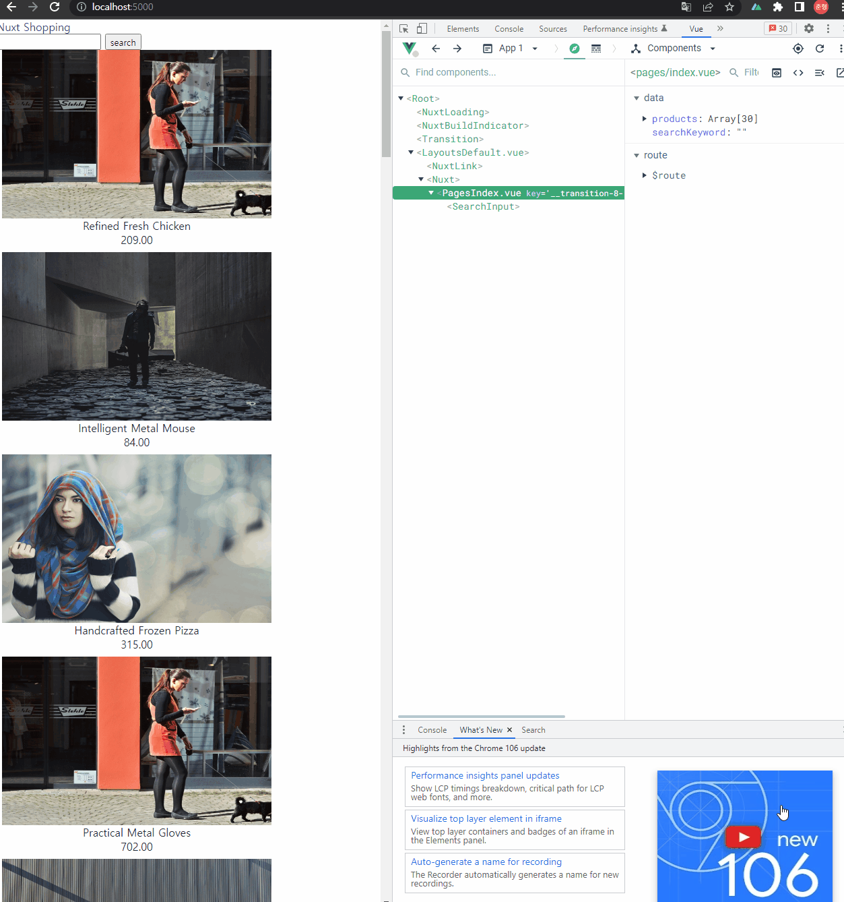
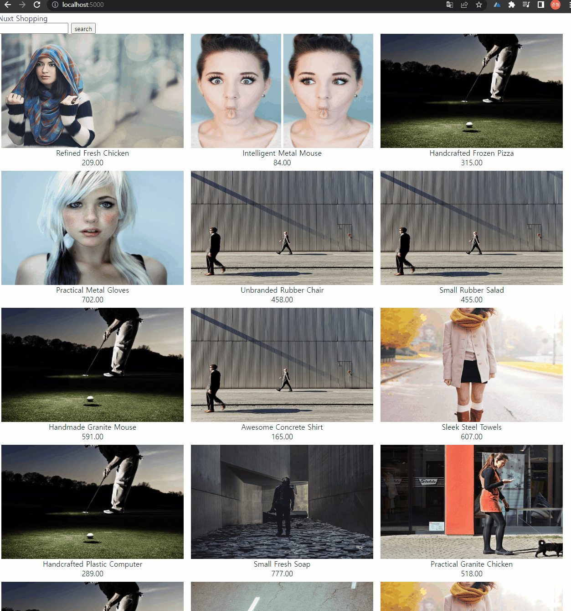
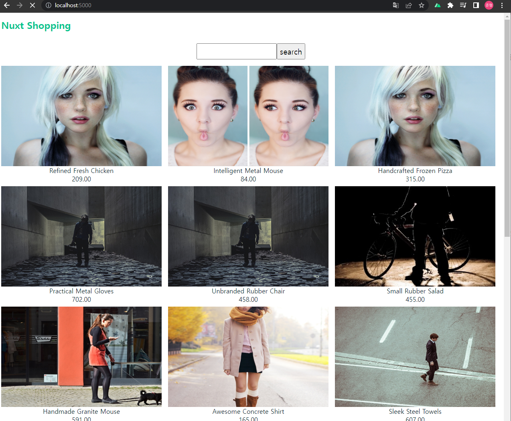

# 05. 쇼핑 상품 검색 UI 개발

## 05-01. 검색 UI 컴포넌트화

검색을위한 `SearchInput 컴포넌트` 를 components폴더에 생성

```vue
// components/SearchInput.vue
<template>
  <div>
    <input type="text">
    <button>search</button>
  </div>
</template>
```

index.vue에 input부분을 수정

```vue
// index.vue
<template>
  <div class="app">
    <main>
      <div>
        <SearchInput></SearchInput>
      </div>
        ...
```


## 05-02. 검색 UI 컴포넌트 데이터, 이벤트 처리

props와 emit설정<br/>(Vue VSCode Snippets가 있으면 vprops를 입력하면 자동완성됨)

```vue
// components/SearchInput.vue
<template>
  <div>
    <input 
      type="text" 
      :value="value" 
      @input="$emit('input', $event.target.value)" />
    <button>search</button>
  </div>
</template>

<script>
export default {
  props:{
    value: {
      type:String,
      default:()=>'',
    }
  }
}
```

```vue
// index.vue
<template>
    <div class="app">
    <main>
      <div>
        <!-- <SearchInput 
          :search-keyword="searchKeyword"
          @input="updateSearchKeyword"></SearchInput> -->
          <SearchInput v-model="searchKeyword"></SearchInput>
      </div>
...
</template>

<script>
import axios from 'axios';
import SearchInput from '~/components/SearchInput.vue';

export default {
...
  data(){
    return{
      searchKeyword: '',
    }
  },
...
}
</script>
...
```

**❗ v-model사용시 SearchInput의 props를 value로 해야한다. 다른 값을 쓰고싶다면, model을 이용할 수 있는데 참고 링크에서 살펴보기.**





**참고**

* [Vue VSCode Snippets 플러그인](https://marketplace.visualstudio.com/items?itemName=sdras.vue-vscode-snippets)
* [v-model 안내 글](https://joshua1988.github.io/web-development/vuejs/v-model-usage/)
* [v-model 강의 영상](https://www.inflearn.com/course/vue-ts/lecture/68020?tab=curriculum)
* [model 속성 API 문서](https://vuejs.org/v2/api/#model)


## 05-03. 검색을 위한 API 함수 설계 및 구현

button에 click이벤트를 추가.

```vue
// SearchInput.vue
<template>
  <div>
    <input 
      type="text" 
      :value="value" 
      @input="$emit('input', $event.target.value)" />
    <button type="button" @click="$emit('search')">search</button>
  </div>
</template>
...
```

❗ click이벤트에 바로 내용을 쓰는 것 보다 method로 빼는 것이 `testable code(테스트 하기 쉬운 코드)`이다.


```vue
<template>
  <div class="app">
    <main>
      <div>
        <!-- <SearchInput 
          :search-keyword="searchKeyword"
          @input="updateSearchKeyword"></SearchInput> -->
          <SearchInput v-model="searchKeyword" @search="searchProducts"></SearchInput>
      </div>
...
 methods:{
    ...
    searchProducts(){
      this.searchKeyword
    },
  }
```

searchKeyword로 api를 호출해야한다.

JSON Server Operator에 가보면 _like를 쿼리스트링으로 보내면 이름으로 필터링 한다.

api를 추가하고 index.vue에서 사용.

```javascript
// api/index.js
...
function fetchProductsByKeyword(keyword){
  return instance.get(`/products`, {params: {name_like: keyword}})
}
export {fetchProductById, fetchProductsByKeyword}
```

```vue
// index.vue
...
<script>
...
methods:{
    moveToDetailPage(id){
      this.$router.push(`detail/${id}`);
    },

    async searchProducts(){
      const response = await fetchProductsByKeyword(this.searchKeyword);
      console.log(response);
    },
  }
</script>
...
```


**참고**

* [JSON Server Operator 링크](https://github.com/typicode/json-server#operators)


## 05-04. 검색 기능 마무리

searchProducts에서 이전에 map으로 랜덤 번호 부여했던 부분을 추가하면서 다시 products에 결과 값을 set해보자

```vue
// index.vue
...
<script>
...
async searchProducts(){      
    const response = await fetchProductsByKeyword(this.searchKeyword);
    // console.log(response);
    this.products = response.data.map(item=>({
        ...item, 
        imageUrl: `${item.imageUrl}?random=${Math.random()}`
    }));
},
...
</script>
```




## 05-05. 헤더와 검색 UI 스타일 정리

default.vue의 헤더 부분과 SearchInput에 style과 class를 아래 링크를 참고해 수정.

```vue
// default.vue
<template>
  <div>
    <header class="title">
        <NuxtLink to="/" class="logo">Nuxt Shopping</NuxtLink>
    </header>
    <Nuxt/>
  </div>
</template>

<script>
...
</script>

<style scoped>
/* 헤더 관련 정보 */
header {
  height: 60px;
  display: flex;
  align-items: center;
  padding: 0 0.5rem;
}
.logo {
  font-weight: 900;
}
.logo:visited {
  color: inherit;
}
</style>
```

```vue
// SearchInput.vue
<template>
  <div class="input-wrapper flex">
    <input 
      type="text" 
      class="search-input"
      :value="value" 
      @input="$emit('input', $event.target.value)" />
    <button class="btn" type="button" @click="$emit('search')">search</button>
  </div>
</template>

<script>
...
</script>

<style scoped>
.input-wrapper {
  height: 40px;
  margin: 1rem 0;
}
.search-input {
  width: 200px;
  font-size: 1.2rem;
  font-weight: 500;
}
.btn {
  font-size: 1.2rem;
  font-weight: 500;
}
</style>
```



**참고**

- [AppHeader.vue 파일 링크](https://github.com/joshua1988/learn-nuxt/blob/master/components/AppHeader.vue)
- [SearchInput.vue 파일 링크](https://github.com/joshua1988/learn-nuxt/blob/master/components/SearchInput.vue)