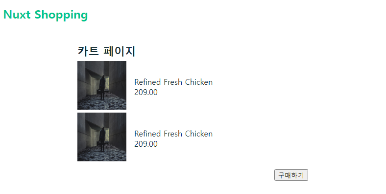

# 06. 장바구니 페이지를 개발하여 학습하는 Vuex

## 06-01. [실습] 카트 페이지 제작 실습 안내

* 상세페이지에서 장바구니 버튼을 추가.

* 메인페이지에서 우측 아래에 장바구니로 이동 버튼을 추가.
* 담는 기능은 제외하고 cart페이지로 이동하게 실습.

1. pages폴더 아래에 cart.vue 생성
2. defualt.vue에서 button을 추가해 `position:fixed`로 우측 아래 고정.<br/>클릭 이벤트로 라우터 이동 추가
3. _id.vue에서 클릭 이벤트로 라우터 이동 추가(addToCart에 작성)

**실습 결과**


## 06-02. 카트 페이지 제작 및 라우팅 동작 확인

1.pages에 cart.vue생성.

2._id.vue에서 method에 addToCart작성

```vue
// _id.vue
...
<script>
...
methods:{
    addToCart(){
        this.$router.push('/cart')
    }
}
...
</script>
```


## 06-03. 메인 페이지의 카트 페이지 이동 기능 구현

직접 만들어도되고, 이전에 가져왔던 css를 마크업 해도 된다.

실습때 default.vue에다 추가를 하였었는데 이 경우 다른 페이지에서도 해당 버튼이 보이게 되버려서

index.vue에 다시 작성하였다.

(마크업부분은 생략)


## 06-04. Nuxt에서의 Vuex사용 방법 소개

상세 페이지에서 정보를 가지고 넘어가야한다.

nuxt store에 대해 알아보자.

Nuxt에서 Vuex를 사용하려면 프로젝트 폴더 루트 레벨에 `store`폴더를 생성하고 그아래 `js`파일을 생성

Vuex의 중요성을 Nuxt에서 인식하여 내장하였다.

pages폴더에서 페이지 생성 시 자동으로 라우팅되듯 store에 js를 만들면 바로 만들어진다.

index.js파일을 만들고 `.nuxt`폴더를 보면 store가 자동생성 되는걸 볼 수 있다.


nuxt에서 제공하는 속성들 규칙만 index.js에 작성해주면되는데 참고 링크를 보고 작성해 나가자.


**참고**

* [Vuex in Nuxt 문서](https://joshua1988.github.io/vue-camp/nuxt/store.html)


## 06-05. Nuxt에서 Vuex 시작하기

nuxt의 경우 파일의 모듈화가 파일의 이름으로 되기 때문에 기본적으로 index.js로 하는것을 추천.

```javascript
// store/index.js
export const state = () => ({
  user: {}
})

export const mutations = {
  setUser(state, user) {
    state.user = user;
  }
}

export const actions = {
  async fetchUser(context) {
    const response = await axios.get('users/1');
    context.commit('setUser', response.data);
  }
}
```


카트를 가지고 state먼저 작성해보자.

(Vue DevTools에서 cartItems가 추가된걸 볼 수 있다.)

```javascript
export const state = () => ({
  cartItems: [], // 장바구니 페이지에서 보여져야 되고, 메인페이지, 상세페이지에서 보여져야하는 정보.
})
```


## 06-06. 상세 페이지의 장바구니 담기 기능 구현

간단하게 vuex를 살펴보면, 

* state는 상태 
* mutation은 상태를 변경하며 컴포넌트에서 commit으로 호출가능


이어서 mutation을 작성해보자.

```javascript
// store/index.js
...
export const mutations = {
  addCartItem(state, cartItem){
    state.cartItems.push(cartItem);
  }
}
```

이 addCartItem을 호출해보자.

```vue
// _id.vue
...
<script>
...
methods:{
    addToCart(){
      this.$store.commit('addCartItem', this.product)
      this.$router.push('/cart')
    }
  }
</script>
...
```


## 06-07. 장바구니 페이지의 장바구니 목록 조회 기능 구현

cart페이지의 내용을 state의 cartItems가 반복해서 리스트가 보이게 수정.

```vue
// cart.vue
<template>
  <div>
    <h1>카트 페이지</h1>
    <div>
      <ul>
        <li v-for="cartItem in $store.state.cartItems" :key=cartItem.id>
          <div>
            
            <p>{{cartItem.name}}</p>
          </div>
        </li>
      </ul>
    </div>
    <div>
      <button>구매하기</button>
    </div>
  </div>
</template>
```

vuex는 자바스크립트이기 때문에 스크립트가 재실행될때마다 data가 다시 선언되기 때문에 값이 비워진다.

서버쪽에 데이터를 저장해두고 불러오거나 localstorage를 이용한다.

(방법에 대해서는 이후 강의에서)


## 06-08. 카트 페이지 스타일 정리

아래 링크를 참고해 마크업.

```vue
// cart.vue
<template>
  <div class="container">
    <h1 class="list-title">카트 페이지</h1>
    <div class="list-wrapper">
      <ul>
        <li 
          v-for="cartItem in $store.state.cartItems" 
          :key=cartItem.id 
          class="lsit-item">
          
            
            <div class="description">
              <p>{{cartItem.name}}</p>
              <span>{{certItem.price}}</span>
            </div>
        </li>
      </ul>
    </div>
    <div class="extra-panel">
      <button>구매하기</button>
    </div>
  </div>
</template>

<style scoped>
.container {
  margin: 2rem 10rem;
}
.list-title {
  font-weight: 700;
  font-size: 1.4rem;
}
.list-wrapper {
  margin: 0.4rem 0;
}
.list-item {
  display: flex;
}
.thumbnail {
  width: 100px;
  height: 100px;
}
.description {
  padding: 2rem 1rem;
}
.extra-panel {
  text-align: right;
  padding: 0.2rem 0;
}
</style>
```




같은 이미지가 나오지 않게 변경

```javascript
// store/index.js
...
export const mutations = {
  addCartItem(state, cartItem){
    const newCartItem = {
      ...cartItem, 
      imageUrl: `${cartItem.imageUrl}?random=${Math.random()}`
    }
    state.cartItems.push(newCartItem);
  }
}
```


**참고**

- [카트 페이지 스타일 코드 링크](https://github.com/joshua1988/learn-nuxt/blob/master/pages/cart.vue)