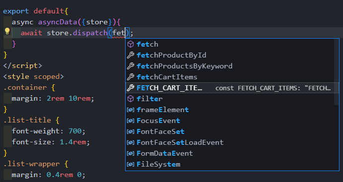
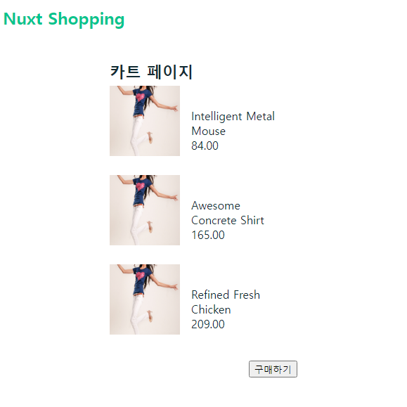
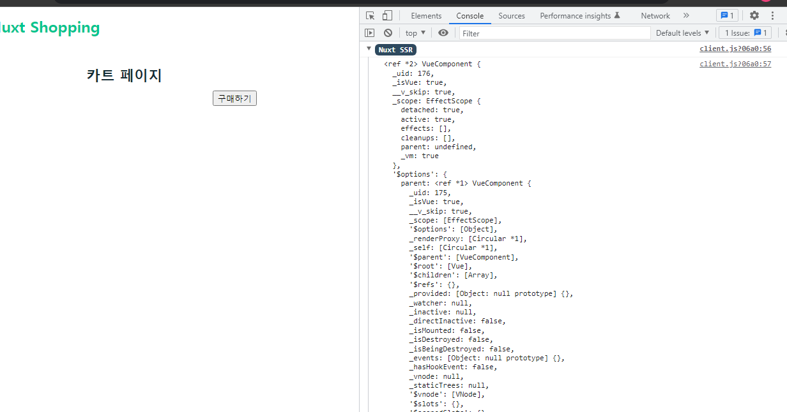
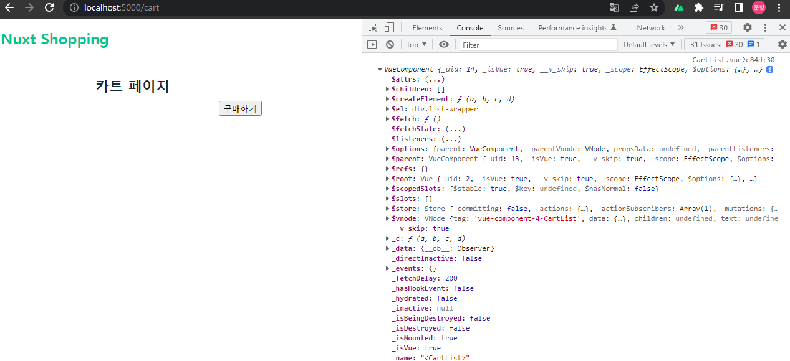

# 07. 장바구니 페이지 리팩토링 및 문제점 해결

## 07-01. 현재 구현 방식의 문제점

새로고침 시 vuex에 데이터가 들어있어 vuex의 데이터가 초기화된다.

2가지 방식이 있따.

* 새로고침시 브라우저 레벨의 저장소를 이용 (로컬 스토리지, 세션 스토리지, ...)
* 카트에 아이템을 추가했을 떄 카트의 데이터를 서버로 보내서 서버쪽에 저장해두고 계정별로 데이터를 조회해오는 방식.

두 번째 방식으로 진행해볼 예정.

backend페이지의 `/cart`를 이용.


## 07-02. 장바구니 목록 추가 기능 API 연동

api파일에 `createCartItem` 추가 작성

instance작성 시 하나의 instance를 사용하기 보다는 공통 URL별로 instance를 만드는 패턴도 있다.

```javascript
const products = axios.create({
  baseURL: 'http://localhost:3000/products',
})
const carts = axios.create({
  baseURL: 'http://localhost:3000/carts',
})

function fetchProductById(id) {
  return products.get(`/${id}`)
}

...

function createCartItem() {
  return carts.get(`/carts/${id}`)
}
```


실습에서는 그냥 하나의 instance로 진행다시 createCartItem을 작성해보자.

```javascript
// api/index.js
...

function createCartItem(cartItem) {
  return instance.post(`/carts`, cartItem)
}
export {fetchProductById, fetchProductsByKeyword, createCartItem}
```


_id.vue로가서 addToCart부분을 수정해보자.<br/>넘겨줄 데이터는 product이다.

```vue
...
<script>
...
async addToCart(){
    const response = await createCartItem(this.product);
    console.log(response);
    this.$store.commit('addCartItem', this.product)
	this.$router.push('/cart')
}
</script>
```

```text
// 결과 object
{
    "data": {
        "id": 8,
        "name": "Refined Fresh Chicken",
        "price": "209.00",
        "imageUrl": "http://placeimg.com/640/480/fashion"
    },
    "status": 201,
    "statusText": "Created",
    "headers": {
       ...
    },
    "config": {
        ...
    }
}
```

url부분을 주소창에 쳐보면 추가된걸 확인할 수 있다.

`http://localhost:3000/carts`


## 07-03. 장바구니 목록 조회 기능 API 연동

actions를 이용하여 cart목록 조회하는 api를 구현해보자.

api작성시 이름은 mutation이나 action들을 별도의 상수화를 했을 때 타입추론등의 이점이 있다.

api와 actions에 작성.

```javascript
// api/index.js
...
function fetchCartItems(){
  return instance.get(`/carts`)
}
export {...}
```

```javascript
// store/index.js
import { fetchCartItems } from "~/api";
...

export const actions = {
  async FETCH_CART_ITEMS({commit}){
    const response = await fetchCartItems();
    console.log(response)
  }
}
```


cart.vue에서 response를 화면에 찍어보자.

```vue
...
<script>
export default{
  asyncData({store}){
    store.dispatch('FETCH_CART_ITEMS');
  }
}
</script>
...
```

> 상수화가 좋은 부분
>
> 웹 서비스가 커지게 되고, 동일한 액션이나 mutation함수를 여러번 호출한다 가정하고, 상수화를 해보자.
>
> ```javascript
> export const FETCH_CART_ITEMS = 'FETCH_CART_ITEMS'
> 
> export const actions = {
>   async [FETCH_CART_ITEMS]({commit}){
>     const response = await fetchCartItems();
>     console.log(response)
>   }
> }
> ```
>
> 상수 FETCH_CART_ITEM을 export시켜서 dispatch작성시 자동 추론되는 것을 볼 수 있다.
>
> 


서버 쪽에서 아래처럼 data가 들어온 것을 볼 수 있다.

```json
data: [
    {
      id: 1,
      name: 'Intelligent Metal Mouse',
      price: '84.00',
      imageUrl: 'http://placeimg.com/640/480/fashion'
    },
    {
      id: 7,
      name: 'Awesome Concrete Shirt',
      price: '165.00',
      imageUrl: 'http://placeimg.com/640/480/fashion'
    },
    {
      id: 8,
      name: 'Refined Fresh Chicken',
      price: '209.00',
      imageUrl: 'http://placeimg.com/640/480/fashion'
    }
  ]
```


cart.vue에서 dispatch를 호출하고, actions에서 state에 data를 넣는 식으로 마저 작성.

```vue
// cart.vue
...
<script>
import { FETCH_CART_ITEMS } from '~/store';

export default{
  async asyncData({store}){
    await store.dispatch(FETCH_CART_ITEMS);
  }
}
</script>
```


```javascript
// store/index.js
...
export const mutations = {
  ...
  setCartItems(state, cartItems){
    state.cartItems = cartItems;
  }
}

export const FETCH_CART_ITEMS = 'FETCH_CART_ITEMS'

export const actions = {
  async [FETCH_CART_ITEMS]({commit}){
    const {data} = await fetchCartItems();
    commit('setCartItems', data);
  }
}
```


**결과 화면**



> ❗ 이런 방식의 이점
>
> PC에서 담아두고 모바일에서 결제한다고 했을 때 `브라우저 저장소`를 이용하면 해당 PC에서의 기록만 볼 수 있는데 계정 기반으로 기기를 바꾸더라도 저장된 데이터를 볼수 있게 된다.


## 07-04. nuxtServerInit 소개

`nuxtServerInit속성`은 nuxt의 **`universal`**모드에서 사용할 수 있는 액션 속성입니다.

```javascript
// store/index.js
actions: {
  nuxtServerInit(context, { req }) {
    if (req.session.user) {
      context.commit('user', req.session.user)
    }
  }
}
```

**server side rendering 시점에 실행**되기 때문에 **스토어에 미리 데이터를 설정**해 놓거나 **서버에서만 접근할 수 있는 데이터를 다룰 때** 유용함.

만약 서버에서 세션을 관리하는 구조이고, 세션에 연결된 사용자 정보를 스토어에 저장해야 할 떄 위와 같은 방식으로 사용자 정보를 스토어에 미리 담아 놓을 수 있다.

>  실습 예제로 설명하자면, 
>
> cart.vue에서 asyncData를 사용해서 페이지 진입전에 데이터를 세팅하겠다고 사용했었는데
>
> 이보다 **더 이른 시점에 store객체를 생성할 때** nuxtServerInit이 동작하고, 그 때 값이 설정되게 한다.

SSR방식은 인증이나 토큰관리등을 서버쪽에서 관리.

이 서버쪽에 바로 값을 접근할 필요가 있을 때 nuxtServerInit 활용.


첫번째 파라미터는 스토어의 컨텍스트 정보를 접근할 수 있는 객체, <br/>두번째는 넉스트의 컨텍스트 정보가 담긴 객체 (asycData의 context와 같다.)

```javascript
// store/index.js
actions: {
  nuxtServerInit(storeContext, nuxtContext) {
    storeContext.commit('뮤테이션 함수명');
    if (process.server) {
      const { req, res, beforeNuxtRender } = nuxtContext;
    }
  }
}
 
```

❗ **`asyncData보다 더 일찍, store객체가 생성 될 때!`** 를 기억하자.

**참고**

* [nuxtServerInit 공식문서](https://nuxtjs.org/docs/directory-structure/store#the-nuxtserverinit-action)

* [nuxtServerInit속성](https://joshua1988.github.io/vue-camp/nuxt/store.html#nuxtserverinit)


## 07-05. nuxtServerInit 적용 및 특성 안내

nuxtServerInit 속성을 이용해서 장바구니 조회 기능 변경

`FETCH_CART_ITEM`의 내용 부분을 nuxtServerInit에 들고와 수정

```javascript
// store/index.js
...
export const actions = {
 ...
  async nuxtServerInit(storeContext, nuxtContext){
    const {data} = await fetchCartItems();
    storeContext.commit('setCartItems', data.map(item=>({
      ...item,
      imageUrl: `${item.imageUrl}?random=${Math.random()}`
    })));
  }
}
```

nuxtServerInit은 어디서든지 호출할 필요가 없다.<br/>(nuxt가 실행될때 알아서 실행된다.)

cart.vue에서 asyncData에서 호출하던 부분도 필요가 없어졌다.

> ❗ 관리시 여러가지 데이터들을 nuxtServerInit에 작성하면 관리가 어렵다.
>
> **각각의  로직을 action으로 분류하여 호출하기를 권장!**
>
> ```javascript
> // store/index.js
> export const FETCH_CART_ITEMS = 'FETCH_CART_ITEMS'
> 
> export const actions = {
>   async [FETCH_CART_ITEMS]({commit}){
>     const {data} = await fetchCartItems();
>     commit('setCartItems', data.map(item=>({
>       ...item,
>       imageUrl: `${item.imageUrl}?random=${Math.random()}`
>     })));
>   },
>   async nuxtServerInit(storeContext, nuxtContext){
>     await storeContext.dispatch(FETCH_CART_ITEMS);
>     // const {data} = await fetchCartItems();
>     // storeContext.commit('setCartItems', data.map(item=>({
>     //   ...item,
>     //   imageUrl: `${item.imageUrl}?random=${Math.random()}`
>     // })));
>   }
> }
> ```


## 07-06. fetch 속성이 필요한 이유

Cart.vue의 리스트내용을 컴포넌트와 진행

```vue
// cart.vue
<template>
  <div class="container">
    <h1 class="list-title">카트 페이지</h1>
    <CartList></CartList>
    <div class="extra-panel">
      <button>구매하기</button>
    </div>
  </div>
</template>
...
```

```vue
// CartList.vue
<template>
  <div class="list-wrapper">
      <ul>
        <li 
          v-for="cartItem in $store.state.cartItems" 
          :key=cartItem.id 
          class="list-item">
          
            
            <div class="description">
              <p>{{cartItem.name}}</p>
              <span>{{cartItem.price}}</span>
            </div>
        </li>
      </ul>
    </div>
</template>
...
```

보통 CartList에서 각각의 리스트 아이템까지 컴포넌트 화를 진행할텐데 그러면 매번 Page컴포넌트(cart.vue)에서 데이터를 불러서 두단계 내려주어야한다.

즉, **불필요하게 props를 많이 내려야하는 상황이 올 수 있다.**


해당 UI에 컴포넌트 영역이 정해져 있을 거고, UI와 관련된 코드들은 컴포넌트에 직접적으로 들어가 있는게 훨씬 더 찾아가기도 수월하고, 문제 발생시 따라가기가 수월하다.

그렇담 CartList.vue에서 데이터를 불러오게끔 해야한다. (현재는 store에서 값을 바로불러와 문제가 없다.)


nuxtServerInit을 주석처리하고 CartList에서 asyncData로 불러오자.

```vue
// components/CartList.vue
...
<script>
import { FETCH_CART_ITEMS } from '~/store'
export default {
  async asyncData({store}){
    await store.dispatch(FETCH_CART_ITEMS)
  }
}
</script>
```

이렇게 되면 정상 동작하지 않는다.

일반 컴포넌트에서 데이터를 불러오기 위해서는 다른 속성을 써주어야 한다.

**바로 `fetch`다.**


## 07-07. fetch속성 소개와 적용

`fetch`는 페이지 컴포넌트 뿐만 아니라 일반 뷰 컴포넌트에서도 사용할 수 있는 데이터 호출 속성.

**❗호출되는 경우**

* 서버 사이드 렌더링을 위해 **서버에서 화면을 구성할 때 컴포넌트가 생성되고 나서 실행**됨.
* 브라우저에서 **URL주소를 변경해서 페이지를 이동**할 때

**asyncData와 fetch 둘 다 동일한 시점에 호출**이 된다. (coding convention을 잘 정해서 상황에 맞게 사용)

```vue
// components/CartList.vue
..
<script>
import { FETCH_CART_ITEMS } from '~/store'
export default {
  // async asyncData({store}){
  //   await store.dispatch(FETCH_CART_ITEMS)
  // },
  async fetch(){
    await this.$store.dispatch(FETCH_CART_ITEMS);
  }
}
</script>
```

**참고**

* [공식문서 fetch](https://nuxtjs.org/docs/features/data-fetching/)

* [Nuxt의 비동기 데이터 호출 방법](https://joshua1988.github.io/vue-camp/nuxt/data-fetching.html)


## 07-08. fetch 속성 특성 및 주의사항

fetch Example을 살펴보면 `/`로 접근 후 `/main`으로 이동 했을 때 컴포넌트가 화면에 먼저 뿌려지고 나서 `fetch`가 실행된다.

데이터를 받는동안 `{}`가 먼저 화면에 보이고 잠시 후 데이터가 화면에 그려지는 걸 볼 수 있다.


만약 최초로 웹서비스를 `/main`으로 접근하게 되면 서버에서 화면을 구성할 때 호출된다.

**화면에 데이터가 호출된 상태로 페이지가 표시된다.**


두번째 특징으로는 asyncData에서는 `this`접근이 안되지만, fetch에서는 `this`가 접근이 가능하다.

CartList에서 this를 console로 찍어보자.

**`localhost:5000/cart`바로 진입시**




Nuxt SSR에서 출력되는 것을 볼 수 있다.


**`localhost:5000` -> `localhost:5000/cart`**



VueComponent가 출력되는 것을 볼 수 있다.

브라우저에서 컴포넌트가 이미 생성 되어 있었고, 그 컴포넌트를 가리킨다.

❗ this가 가리키는 것에 주의 하고, 바로 url을 진입한 경우와 다른 url에서 진입하는 경우 차이점이 있다는 것을 기억하자.

❗ 현재 fetch에 파라미터를 넘길 수 없다. 만약 있는 코드가 있다면 레거시 이니까 주의.=> **공식문서 확인**


**참고**

* [크롬 개발자 도구 네트워크 쓰로틀링 방법](https://developer.chrome.com/docs/devtools/network/)
* [Nuxt.js 공식 사이트 fetch 속성](https://nuxtjs.org/docs/2.x/features/data-fetching)