# 08. 제작한 사이트를 배포하며 알아보는 Nuxt.js 배포방식

## 08-01. Nuxt  배포 방식 소개

Nuxt.js 서비스를 배포하는 방법은 프로젝트를 생성할 때 선택한 `Universal모드의 배포방식(SSR / SSG)`에 따라 다르다.


### SSR(Server Side Rendering)

SSR을 선택하여 생성한 경우 `nuxt.config.js`에 target값이 server로 들어가 있을 것이다.<br/>(실습예제의 경우 target의 default값이 server라서 별도로 작성되있지 않다.)


SSR모드로 생성한 웹 서비스는 배포하려는 서버에 **Node.js서버를 실행할 수 있는 형태로 배포**해야함.

(실습에서는 Heroku가 가장 간단하게 배포할 수 있어 Heroku이용.)

**각 클라우드 플랫폼별 가이드**

* [Azure](https://nuxtjs.org/deployments/azure-portal/)

* [Google App Engine](https://nuxtjs.org/deployments/google-appengine/)

* [Heroku](https://nuxtjs.org/deployments/heroku/)

**참고**

* [Nuxt.js 배포 방법](https://joshua1988.github.io/vue-camp/nuxt/deployment.html)


## 08-02. 클라우드 플랫폼 가입 및 앱 생성

**가입 후 기본화면**

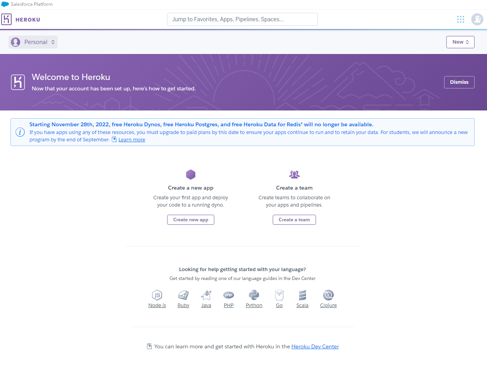

**애플리케이션 생성**

Create new App

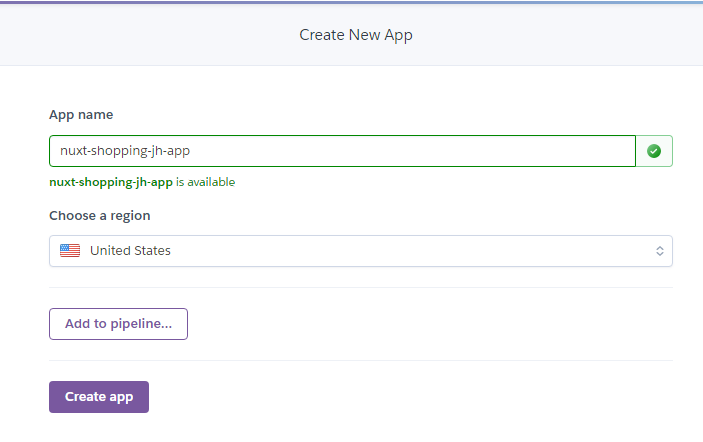

**참고**

- [Heroku 배포 가이드](https://nuxtjs.org/docs/2.x/deployment/heroku-deployment)
- [Heroku 공식 사이트](https://heroku.com/)


## 08-03. 깃헙 소스 업로드 및 리포지토리 연동

배포할 repo를 만들고, 현재까지 실습했던 내용들을 배포할 repo에 넣어두고 Connext한다.


명령어로 실행할 경우 repo생성 후 vscode 에서 다음 명령어를 순차 실행해도 됨.

```shell
git init

git remote add origin "클론할 리포지토리 주소"
```


## 08-04. 배포 및 비정상 동작 확인

Connect가 완료되었다면, Setting의 `Reveal Config Vars`를 클릭하고 사진처럼 추가.<BR/>(key와 value는 공식문서에 안내된 설정 값)

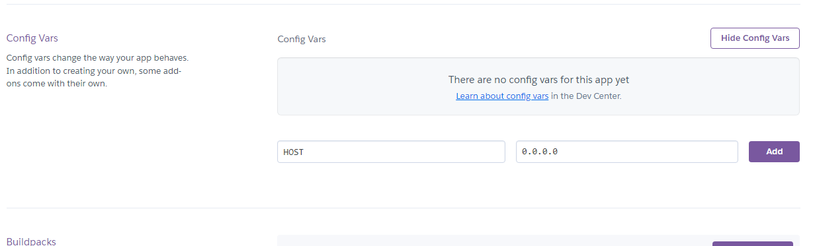


준비완료!


Deploy 탭 가장아래에 branch를 선택하고, Deploy Branch를 확인.

> Deploy Fail
>
> 처음에 Deploy가 Fail이 나서 문제를 읽어보니, node의 version을 명시해주라고 되어 있다.
>
> 그래서 package.json에 `enigens{ node: 버전 }`구문을 추가하였더니 success가 떳다.


실행하게되면 아마 **`Application Error`**가 발생할 것이다.

실습때 서버의 포트 번호를 5000으로 변경 했었다.

heroku에서는 외부에서 접근할 포트를 열었을 텐데 5000이 열려있지 않아 그럴 것이다.

**참고**

* [Heroku 배포 가이드](https://nuxtjs.org/docs/2.x/deployment/heroku-deployment)


## 08-05. 포트 설정 변경 및 에러 분석 방법 안내

Activity탭으로 가게 되면 현재 App의 활동 이력들이 남게된다.

View build log로 로그를 볼 수 있다.

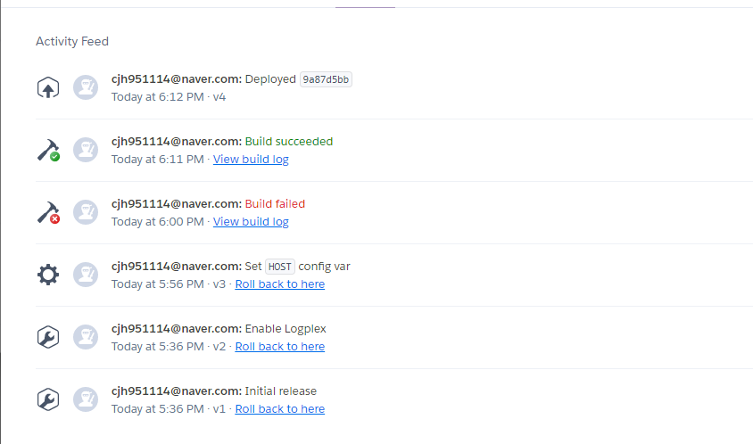

포트 설정을 바꿔보자.

server의 포트 부분을 `process.env.NODE_ENV`로 변경

NODE_ENV는 개발시에는 deployment, 배포시에는 production이 된다.

```javascript
// nuxt.config.js
server:{
    port: process.env.NODE_ENV ==='production' ? null : 5000,
}
```


새로 배포 후 확인해보면 **`Server error`**를 볼 수 있다.

Heroku 우측 상단에 `More버튼`에서 `View logs`를 클릭하게되면 서버쪽 로그를 볼 수 있다.

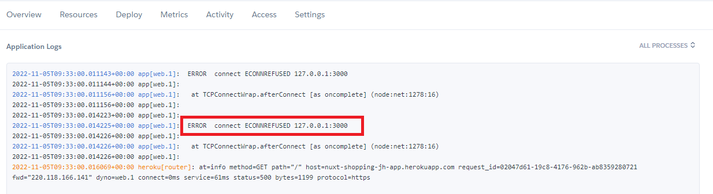

3000번에 대한 connection error를 확인할 수 있다.

로컬에서는 3000번으로 했지만, heroku app에서는 아니기 때문에 에러가 발생.


## 08-06. 백엔드 API 서버 배포

이전 실습에서 사용하던 my-json-server는 실제 데이터 베이스처럼 데이터의 변경사항이 저장되지는 않는다.

사용시 기타 주의 사항들을 숙지할 것!

> ### How to
>
> 1. Create a repository on GitHub (`<yout-username>/<your-repo>`)
> 2. Create a **`db.json`** file
> 3. Visit `https://my-json-server.typicode.com/<yout-username>/<your-repo>` to access your server

open source만 제공하기 때문에 repo생성시 public이되어야한다.

 

`db.json`파일을 옮겨서 push해준다.

**결과**

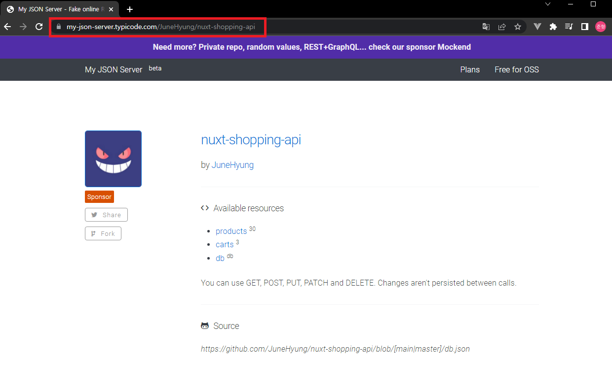**참고**

* [my-json-server](https://my-json-server.typicode.com/)

- [리눅스 명령어 가이드 문서](https://joshua1988.github.io/web-development/linux-commands-for-beginners/)
- [윈도우 콘솔 에뮬레이터 cmder](https://cmder.net/)


## 08-07. 환경 변수를 이용한 API 엔드포인트 변경

이전에 작성한 api를 보자.

나중에 public하게 배포할 때는 baseUrl의 주소가 바뀌어야 한다.

```javascript
import axios from 'axios';

const instance = axios.create({
  baseURL: 'http://localhost:3000/',
})

...
```

baseUrl을 바꾸는 방법은 여러가지가있다.


### 환경변수 이용

nuxt.config.js에 아래내용을 추가.

```javascript
// nuxt.config.js

...
// env
env:{
  baseURL: process.env.NODE_ENV ==='production' 
    ? 'https://my-json-server/JuneHyung/nuxt-shopping-app' 
    : 'http://localhost:3000',
}
```

이후 index.js에서 환경변수로 세팅

```javascript
// api/index.js
const instance = axios.create({
  baseURL: process.env.baseURL,
})
```

**참고**

- [Nuxt.js env 속성](https://nuxtjs.org/docs/2.x/configuration-glossary/configuration-env)


## 08-08. 서버 에러 분석 및 에러 수정

로컬에서 실행하여 localhost로 주소가 입력되는지 확인.

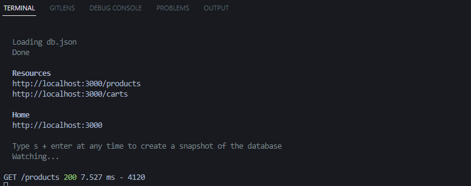

변경사항을 push후 `heroku`에서 다시 배포

로컬에서는 돌아가는걸 확인했지만, 배포 후 여전히 Server에러가 발생.

More Tab에서 내용을 확인해보자.

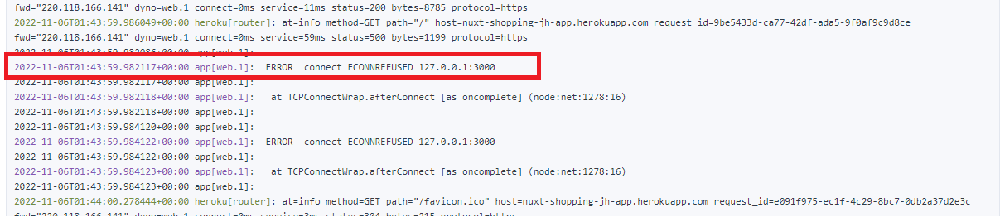

어딘가 localhost를 사용하는 곳이 남아있다.

처음 `pages/index.vue`에서 사용되었다

products를 가져오는 api를 추가하고, 수정.

```vue
// pages/index.vue
...
script>
...
export default {
  components: { SearchInput },
  async asyncData(){
    const response = await fetchProducts;
    // console.log(response);
    const products = response.data.map(item=>({
      ...item, 
      imageUrl: `${item.imageUrl}?random=${Math.random()}`
    }));
    return {products};
  },
```

**❗ 오타때문에 에러가 많이났는데 Error로그 하나씩 보면서 수정해나갈 수 있었다.**

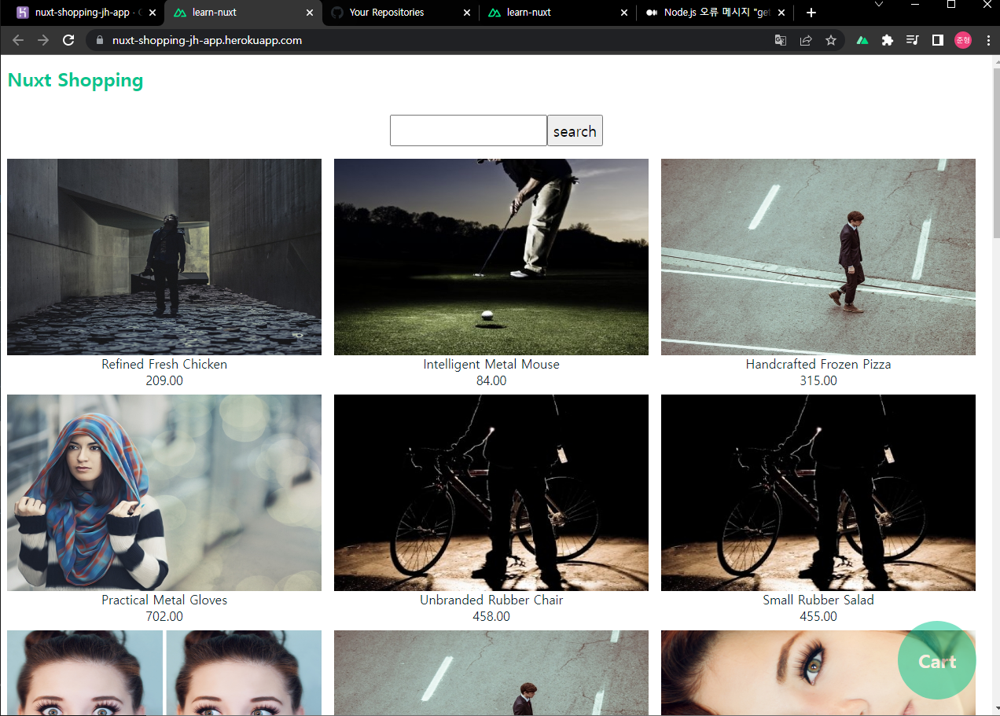

[확인 URL](https://nuxt-shopping-jh-app.herokuapp.com/)


## 08-09. 배포 과정 정리 및 SSR 배포시 유의 사항

`Build Log`를 보면 heroku에서 서버를 배포하는 과정을 볼 수 있다.

```shell
-----> Using buildpack: heroku/nodejs
...

Downloading and installing node 16.18.0...

...

-----> Installing dependencies
       Installing node modules
       
...
```

* 간단한 정보로는 heroku는 heroku내부의 buildpack을 이용한다.
* 설치되는 node의 version의 확인.
* dependencies 또한 확인 가능.

```shell
-----> Build
       Running build
       
       > learn-nuxt@1.0.0 build
       > nuxt build
       
       ℹ Production build
       ℹ Bundling for server and client side
       ℹ Target: server
       ...
```

* `nuxt build`란 명령어를 맨 처음 수행한 걸 볼 수 있다.<br/>package.json에 정의되어 있다.<br/>

  ```json
  "scripts": {
      "dev": "nuxt",
      "build": "nuxt build",
      ...
  ```


로컬에서의 로그와 build log를 비교해보면 동일한 것을 볼 수 있다. 

로컬에서 npm run build후 npm run start 한 것과 배포작업을 하는 것이 동일.

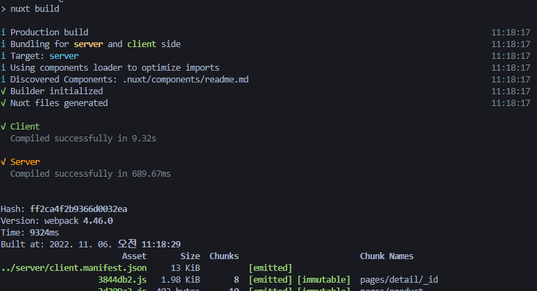

`npm run start`로 node.js 서버를 띄우고, 요청할때 마다  node.js로 접속한다는 것을 알 수 있다.


## 08-10. SSG 배포 방식 안내

**SSG(Static Site Generator)**

**build후 나오는 정적 리소스(html,css,..)을 배포하는 방식**

프로젝트 생성시 옵션을 선택 할 수 있다.

> Jamstack 
>
> 옵션 선택 시 `Static(Static / Jamstack hosting)` 이라 나오는데 <br/>`JAMStack`이란 JavaScript & API & Markup을 의미하며 API 서버 없이 사이트를 제작하는 방식을 의미

```javascript
// nuxt.config.js
export default{
    target: 'static'
}
```


SSG모드는 사용자의 페이지 URL 요청이 들어올 때 마다 서버에서 그려서 브라우저에 보내주는 SSR과 다르게 웹 서비스를 구성하는 모든 페이지를 미리 그려야 하기 때문에 static 서버에 배포하는 형태로 진행해야 한다.

Netlify등의 CD(Continuous Delivery)를 이용해 쉽게 배포가능.<br/>(Netlify로 실습 진행)

- [Netlify(opens new window)](https://nuxtjs.org/docs/2.x/deployment/netlify-deployment)
- [AWS(opens new window)](https://nuxtjs.org/docs/2.x/deployment/deployment-amazon-web-services)
- [Azure Static Web Apps(opens new window)](https://nuxtjs.org/docs/2.x/deployment/deployment-azure-static-web-apps)
- [Github](https://nuxtjs.org/docs/2.x/deployment/github-pages)

**참고**

* [Nuxt.js SSG 배포 방식](https://joshua1988.github.io/vue-camp/nuxt/deployment.html#ssg-static-site-generator)


## 08-11. SSG빌드 명령어 안내 및 SSR 빌드 결과물 비교

```javascript
// nuxt.config.js
export default{
    target: 'static',
    ...
}
```

config.js에 `target: 'static'`을 추가하고, **`npm run generate`**를 실행

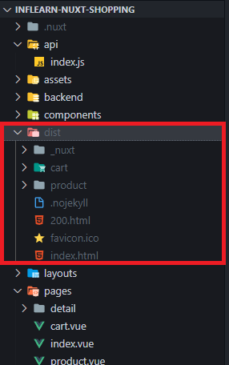

`dist 폴더`가 생긴 것을 볼 수 있다.

`.nuxt`와 `dist`를 비교해보면 `.nuxt`는 node.js코드들이 생성 되있지만, `dist`의 경우 html, css, js등만 생긴 것을 볼 수 있다.

`dist`는 SPA의 결과물(Vue Cli로 빌드 했을 때 결과물)과 매우 흡사함.


## 08-12. SSG 방식 배포 및 결과 확인

Netlify에 Github로 가입하여 repo를 Import한다.(이전에 target속성을 추가해서 push까지 해주기)

설정에 들어와서 `npm run build`로 되있던 부분을 `npm run generate`로만 변경해주면된다.

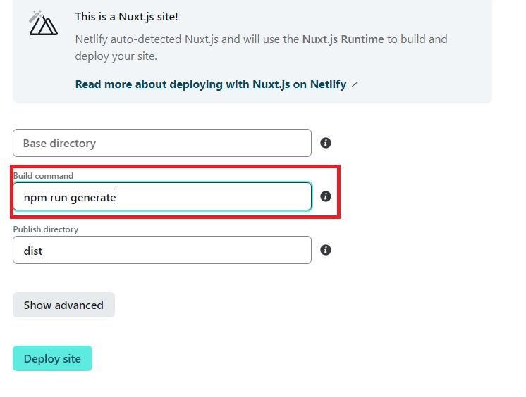

Deploy site후 아래 사진을 클릭하게 되면 Build log를 확인할 수 있다.

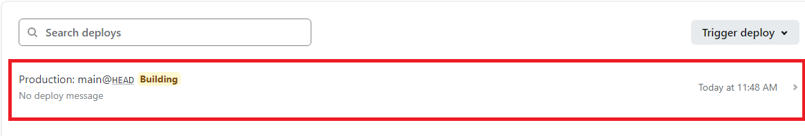


Preview 버튼을 통해 결과를 확인할 수 있다.

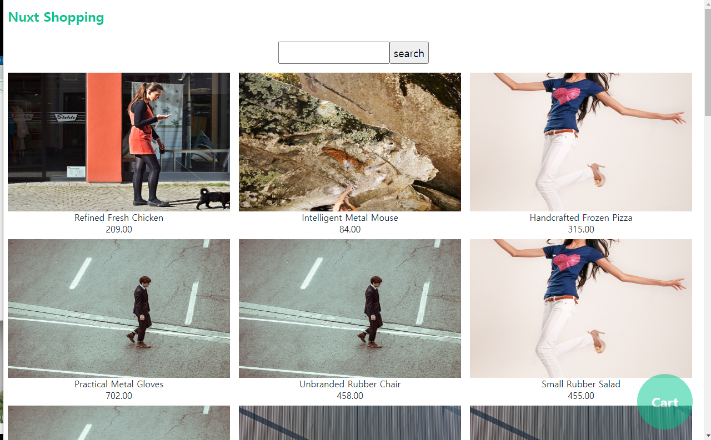

heroku와 결과는 똑같지만, 보여주는 방식의 차이가 있다.
