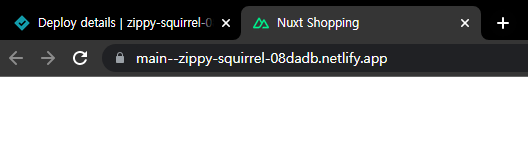

# 09. SEO 최적화와 OG 태그

## 09-01. 메타 태그 설정 방법 안내


배포한 사이트를 카톡으로 링크를 걸면, 타이틀과 description부분이 나오는데 보통 meta태그로 정의를한다.


Nuxt에서 어떻게 설정하는 지 알아보자.

Nuxt로 제작된 애플리케이션의 head값은 `nuxt.config.js`에 설정이 되있다.

```javascript
// nuxt.config.js
export default {
  head: {
    title: 'learn-nuxt',
    htmlAttrs: {
      lang: 'en',
    },
    meta: [
      { charset: 'utf-8' },
      { name: 'viewport', content: 'width=device-width, initial-scale=1' },
      { hid: 'description', name: 'description', content: '' },
    ],
    link: [{ rel: 'icon', type: 'image/x-icon', href: '/favicon.ico' }],
  },
}
```

브라우저에 그려졌을때 아래처럼 변환됨.

```html
<html lang="en">
<head>
  <title>learn-nuxt</title>
  <meta data-n-head="ssr" charset="utf-8">
  <meta data-n-head="ssr" name="viewport" content="width=device-width, initial-scale=1">
  <meta data-n-head="ssr" data-hid="description" name="description" content="">
  <link data-n-head="ssr" rel="icon" type="image/x-icon" href="/favicon.ico">
</head>
...
```


**참고**

- [Metadata MDN](https://developer.mozilla.org/en-US/docs/Glossary/Metadata)

* [페이지 메타 정보 설정](https://joshua1988.github.io/vue-camp/nuxt/meta-tags.html)


## 09-02. 메타 태그 적용 결과 확인

nuxt.config.js에서 head값을 변경해보자.

```javascript
// nuxt.config.js
export default {
  target: 'static',
  // Global page headers: https://go.nuxtjs.dev/config-head
  head: {
    title: 'Nuxt Shopping',
    htmlAttrs: {
      lang: 'en',
    },
    meta: [
      { charset: 'utf-8' },
      { name: 'viewport', content: 'width=device-width, initial-scale=1' },
      { hid: 'description', name: 'description', content: 'Nuxt Shopping Example' },
      { name: 'format-detection', content: 'telephone=no' },
    ],
    link: [{ rel: 'icon', type: 'image/x-icon', href: '/favicon.ico' }],
  },
    ...
```

Title이 바뀐것을 볼 수 있다.




## 09-03. 페이지별 메타 태그 설정 방법

구글 커리어 사이트에서 지역이 다른 두 직무에 대한 공고의 링크를 살펴보자.


직무에 따라 각각 다르게 표현하는 것을 볼 수 있다.


페이지별로 다른 head태그를 작성하고 싶은 경우 각 페이지 컴포넌트에 속성을 추가해야한다.

```vue
<!-- page/home.vue -->
<script>
export default {
  data() {
    return {
      str: 'hi'
    }
  },

  head: {
    title: '페이지 타이틀',
    meta: [
      {
        hid: 'description',
        name: 'description',
        content: '페이지 설명 내용',
      },
    ],
    link: [
      {
        rel: 'stylesheet',
        href: 'https://fonts.googleapis.com/css?family=Roboto&display=swap'
      }
    ]
  },
}
</script>
```

만약 컴포넌트에 정의되있는 뷰 인스턴스 데이터나 computed속성을 메타태그 값으로 연결하고 싶으면 함수형태로 작성.

```vue
<!-- pages/products/_id.vue -->
<script>
export default {
  data() {
    return {
      productName: '바삭한 과자'
    }
  },

  head() {
    return {
      title: `상품 상세 페이지 - ${this.productName}`
    }
  },
}
</script>
```


**참고**

* [페이지별 메타태그 설정 방법](https://joshua1988.github.io/vue-camp/nuxt/meta-tags.html#페이지별-head-태그-설정)


## 09-04. 페이지별 메타 태그 설정 및 확인

적용해보자.

```vue
// pages/detail/_id.vue
...
<script>
import {createCartItem, fetchProductById} from '@/api/index';
export default {
  async asyncData({params}){
    // const id = params.id
    const response = await fetchProductById(params.id)
    const product = response.data;
    return {product}
  },
  head: {
    title: 'Shopping Item Detail',
    meta: [
      {
        hid: 'description',
        name: 'description',
        content: '이 상품은 ~~입니다.',
      },
    ],
  },
  ...
}
</script>
```


❗ 주의 hid이름을 다르게 하게되면, 덮어씌우는게 아닌 새로운 태그가 생기므로 `nuxt.config.js`와 페이지별 hid값을 일치시켜야함.


**참고**

* [페이지별 메타태그 설정 방법](https://joshua1988.github.io/vue-camp/nuxt/meta-tags.html#페이지별-head-태그-설정)
* [라우터 히스토리 모드 관련 문서](https://router.vuejs.org/guide/essentials/history-mode.html)
* [SPA 배포시 서버 설정 관련 안내 영상(Vue.js 완벽 가이드 강의 - 결제 필요)](https://www.inflearn.com/course/vue-js/lecture/21393)
* [Netlify Redirect 설정 문서](https://docs.netlify.com/routing/redirects/rewrites-proxies/#history-pushstate-and-single-page-apps)


## 09-05. 메타 태그에 뷰 데이터 연결하는 방법

좀 더 명확한 페이지를 나타내기 위해 상품명을 title에 연결해보자

객체형태로 선언한 head를 함수형태로 변경해주어야한다.

```vue
...
<script>
...
head(){
    return {
        title: `Shopping Item Detail - ${this.product.name}`,
        meta: [
            {
                hid: 'description',
                name: 'description',
                content: `이 상품은 ${this.product.name}입니다.`,
            },
        ],
    }
},
</script>
...
```


## 09-06. OG(Open Graph)태그  소개

**OG(Open Graph)태그**는 SNS상에서 공유할 때 해당 페이지 정보가 잘 드러날 수 있도록 지원해주는 메타태그.

```javascript
<script>
export default {
  head: {
    title: '상품 상세 페이지',
    meta: [
      {
        hid: 'og:title',
        property: 'og:title',
        content: '상품 상세 페이지'
      },
      {
        hid: 'og:description',
        property: 'og:description',
        content: '상품의 상세 정보를 확인해보세요'
      },
      {
        hid: 'og:image',
        property: 'og:image',
        content: 'http://placeimg.com/640/480/fashion'
      },
    ]
  }
}
</script>
```

앞에 og가 붙어있는 것을 볼 수 있다.

**참고**

- [카카오 OG 태그 디버깅 도구](https://developers.kakao.com/tool/clear/og)
- [페이스북 OG 태그 디버깅 도구](https://developers.facebook.com/tools/debug/)


## 09-07. OG태그 디버깅 방법

아래 디버깅 도구에서 URL을 입력하고 캐시 데이터를 초기화 할 수 있다.


**참고**

- [카카오 OG 태그 디버깅 도구](https://developers.kakao.com/tool/clear/og)
- [페이스북 OG 태그 디버깅 도구](https://developers.facebook.com/tools/debug/)